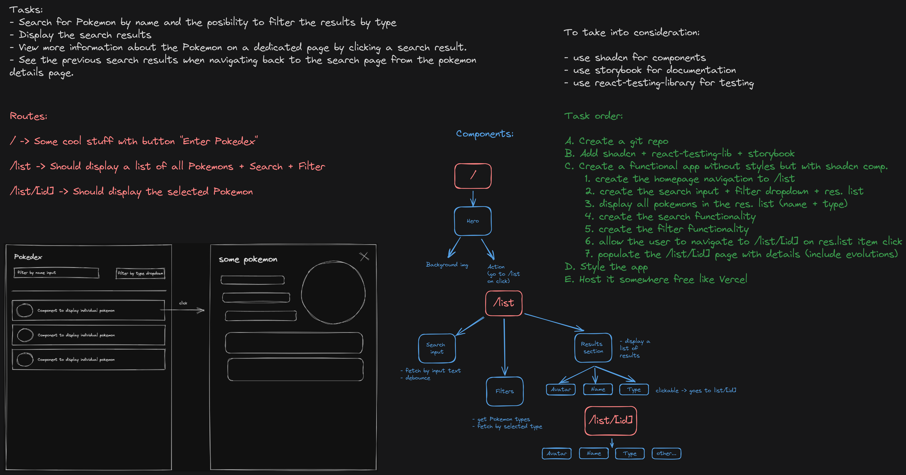

# Nuant FE Test - nandramihnea version

Demo link: [Demo](https://pokedex-mihnea.netlify.app/)

In this repo you will find everything you need to know about how I went on implementing the task.
Starting from ideation phase to implementation and deployment in the end.

### Ideation phase

In this image you can see what was my tought proccess during the ideation phase:

- Firstly copied the tasks to be done in order to see them more clearly
- Afterwards decided what routes should the app have
- Broke down the routes into components
- Decided what things I should take into consideration while developing
- Finally broke down the main task into smaller ones

### Tests

Tests can be run by using the `npm run test` command

### Documentation (Storybook)

Storybook documentation can be run by using the `npm run storybook` command

### Challanges faced

1. installing shadcn on vite was quite nasty for a first try because I faced a time consuming error ~35'
   because the command to initalize shadcn was using yarn behind npx and I didn't have yarn installed globally
